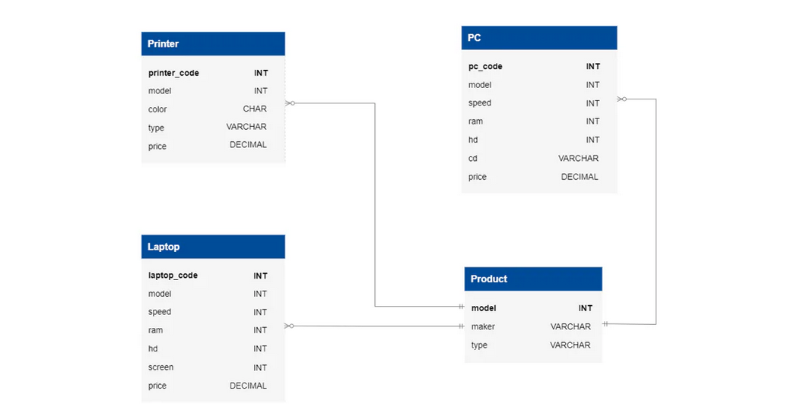

# Stage 1/4: Expensive printers
## Description
As a computer store manager, staying informed about the store's condition and the products is crucial. It's vital to gather information about expensive items, such as printers, available in limited quantities. This will help you manage inventory effectively and ensure you offer your customers the best products possible.

## Objectives
- Identify printers in your inventory that are priced over $200;
- Find the `model` number, `type`, and `price` of the `Printer`.
- The order of the columns matters.

Take a look at the following database structure:




## Explanation of the database:
The Electronic Store Customer Database encompasses four main tables: Laptop, PC, Printer, and Product.

In-depth details of each table are as follows:

`Product`** table stores information about manufacturers (maker), model numbers (model), and product types (type).  
- `maker`: Manufacturer of a product in the store.
- `model`: Primary key - unique across all manufacturers and product types.
- `type` : Product identification, one of 3 types available: laptop, printer, PC

`PC`** table contains information about each personal computer.
- `pc_code`: Primary key - identified by a unique code.
- `model`: Foreign key - A PC model is indicated with a foreign key to the `Product` table (model).
- `speed` : Processor speed in megahertz.
- `ram` : Memory size in megabytes.
- `hd` : Hard disk capacity in gigabytes.
- `cd` : CD reader speed such as DVD, Blu-ray, or None.
- `price` : Price in dollars.

`Laptop`** table contains information about each laptop.
- `laptop_code`: Primary key - identified by a unique code.
- `model`: Foreign key - A PC model is indicated with a foreign key to the `Product` table (model).
- `speed` : Processor speed in megahertz.
- `ram` : Memory size in megabytes.
- `hd` : Hard disk capacity in gigabytes.
- `screen` : Screen size in inches.
- `price` : Price in dollars.

`Printer`** table provides information about each printer model.
- `printer_code`: Primary key - identified by a unique code.
- `model`: Foreign key - A PC model is indicated with a foreign key to the `Product` table (model).
- `color` : C for color printers, B for black printers.
- `type` : Printer types: Laser for laser printers, Inkjet for inkjet printers, Matrix for matrix printers.
- `price` : Price in dollars.

** Table names are case-sensitive

Click on the [link](Computer_Store.sql) to download the SQL query for creating the database.

## Example

_Printer Table Example:_

| printer_code | model | color | type   | price  |
|--------------|-------|-------|--------|--------|
| 105          | 6001  | C     | Inkjet | 129.99 |
| 106          | 6001  | B     | Laser  | 199.99 |
| 107          | 6001  | C     | Inkjet | 149.99 |
| 108          | 6001  | B     | Laser  | 249.99 |
| 109          | 7001  | B     | Laser  | 349.99 |
| 110          | 7001  | C     | Inkjet | 199.99 |

From the data presented in the table above, it is evident that printers with `printer_codes` `108` and `109`  
have `price` more than $200.
The output of the table after identifying Printers having price greater than $200:

| model | type   | price  |
|-------|--------|--------|
| 6001  | Laser  | 249.99 |
| 7001  | Laser  | 349.99 |


_From the output above, it can be seen that the order of the columns is `model`-> `type` -> `price`_

## Query template:
```markdown
SELECT model, ...;
```