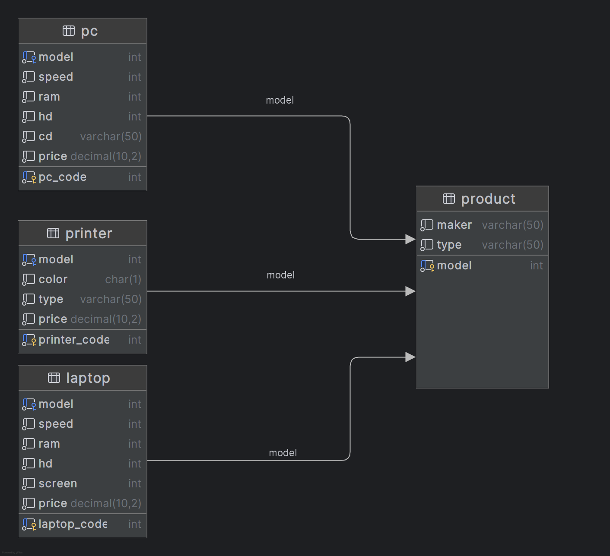

# Stage 3/4: Uniques
## Description
As a computer store manager, your next task is identifying unique product manufacturers delivering only one model.  
By sorting the manufacturers according to their special characteristics, you can determine if these one-product  
producers are essential to your supply chain. If they are not, you may consider cutting off their supplies.

## Objectives
- Using the Product table, determine the number of manufacturers producing one product model;
- Output the Number of unique manufacturers from the Product table.

Take a look at the following database structure:



## Explanation of the database:
The Electronic Store Customer Database encompasses four main tables: Laptop, PC, Printer, and Product.

In-depth details of each table are as follows:

`Product`** table stores information about manufacturers (maker), model numbers (model), and product types (type).  
- `maker`: Manufacturer of a product in the store.
- `model`: Primary key - unique across all manufacturers and product types.
- `type` : Product identification, one of 3 types available: laptop, printer, PC

`PC`** table contains information about each personal computer.
- `pc_code`: Primary key - identified by a unique code.
- `model`: Foreign key - A PC model is indicated with a foreign key to the `Product` table (model).
- `speed` : Processor speed in megahertz.
- `ram` : Memory size in megabytes.
- `hd` : Hard disk capacity in gigabytes.
- `cd` : CD reader speed such as DVD, Blu-ray, or None.
- `price` : Price in dollars.

`Laptop`** table contains information about each laptop.
- `laptop_code`: Primary key - identified by a unique code.
- `model`: Foreign key - A PC model is indicated with a foreign key to the `Product` table (model).
- `speed` : Processor speed in megahertz.
- `ram` : Memory size in megabytes.
- `hd` : Hard disk capacity in gigabytes.
- `screen` : Screen size in inches.
- `price` : Price in dollars.

`Printer`** table provides information about each printer model.
- `printer_code`: Primary key - identified by a unique code.
- `model`: Foreign key - A PC model is indicated with a foreign key to the `Product` table (model).
- `color` : C for color printers, B for black printers.
- `type` : Printer types: Laser for laser printers, Inkjet for inkjet printers, Matrix for matrix printers.
- `price` : Price in dollars.

** Table names are case-sensitive

Click on the [link](Computer_Store.sql) to download the SQL query for creating the database.

## Example

_Product Table Example:_                                          
                                                                 
| model | maker   | type    |  
|-------|---------|---------|
| 1001  | Apple   | Laptop  |  
| 1002  | Apple   | Laptop  |
| 2001  | Acer    | PC      |  
| 3001  | HP      | Printer |  
| 3002  | HP      | Laptop  |
| 4001  | Samsung | Printer |  
| 5001  | Lenovo  | PC      |  
| 5003  | Lenovo  | PC      |
| 5004  | Lenovo  | Laptop  |

From the above table, it can be observed that only `Acer` and `Samsung` manufacturers produce one model. Therefore,  
based on the provided data, the `Number` of unique manufacturers is `2`.

## Query template:
```markdown
SELECT COUNT(maker) as number_of_unique_makers...;
```